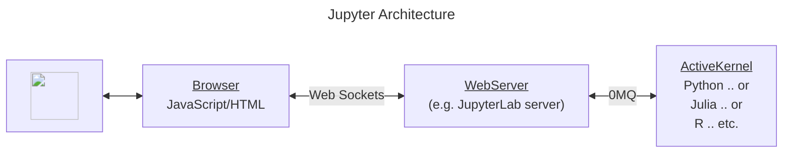
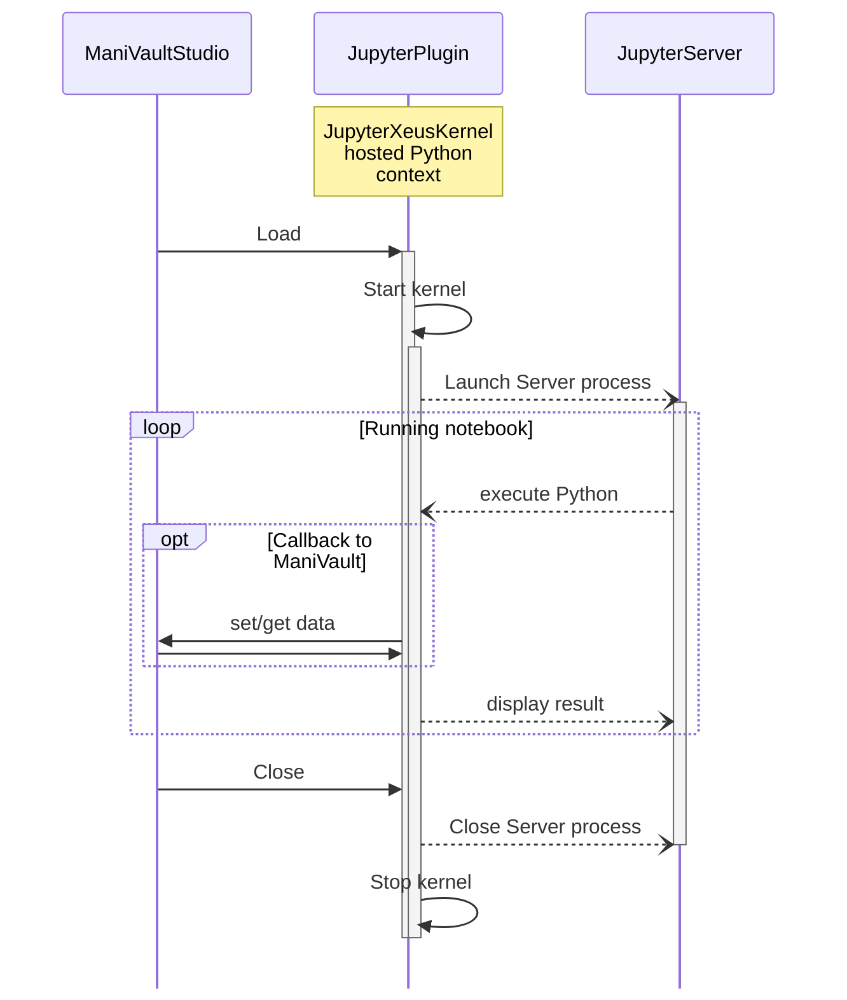
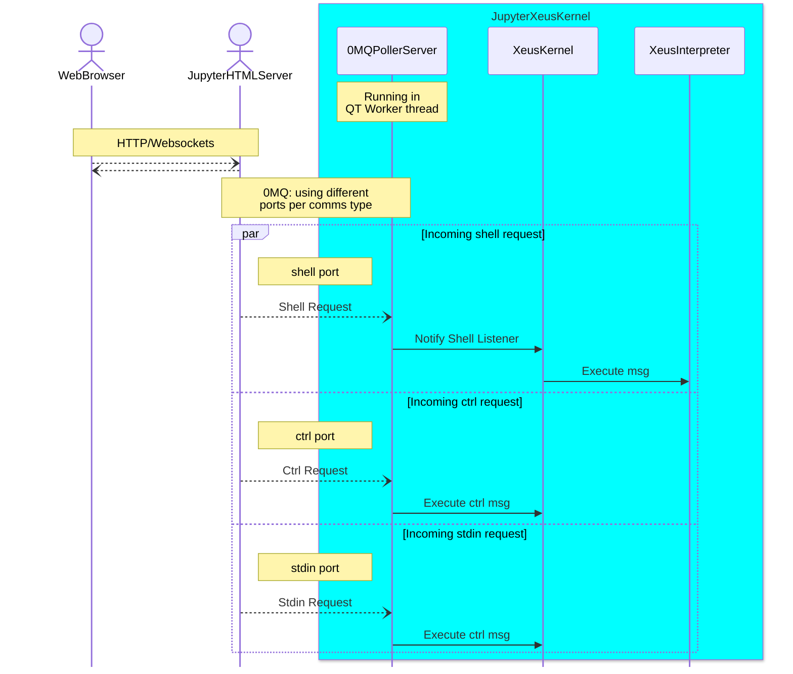

## JupyterPlugin -> JupyterLab Viewer Plugin

The plugin runs a **Jupyverse** Jupyter Lab server. The server offers a connection to the plugin's hosted python kernel.

The plugin supplies a module containing methods that can be accessed from a Jupyter notebook. See the Example notebook for more information.

Although the articture is a view plugin the actual view should be access via a web browser. The plugin it's shows no more than c aconfiguration widget. In addition the URL (along with token) to be used to access this kernel through

### Kernel architecture

The kernel relies on Jupyter-Xeus components to expose a python 3.11 environment. 

The architecture of hte kernel is based on Slicer/SlicerJupyter.  The correspondance is shown in the table below.

ManiVault JupyterPlugin | Slicer SlicerJupyter extension | Manivault Example
---| --- | ---
JupyterXeusKernel | qSlicerJupyterKernelModule | n.a.
JupyterPlugin | qSlicerJupyterKernelModuleWidget | ExampleViewPlugin

  

## Understanding Jupyter and the PythonJupyterPlugin

### Basic Jupyter architecture

This is a brief introduction to how JupyterLab/Notebook works, it assumes that your are familiar with running and using JupyterLab/Notebook from a python environment with a web browser.

Jupyter comprises a webserver that can ve viewed using a standard HTTP and JavaScript capable webbrowser. The webserver communicates with and a kernel running in a process separate over 0MQ ([ZeroMQ](https://zeromq.org/)) on a number of ports. 

An <ins>ActiveKernel</ins> is an execution context in which language commands are executed. Jupyter supports multiple kernels we are interested in a Python kernel that will be hosted in our plugin. 

### Startup & Shutdown

As is clear from the architecture starting the plugin depends on a <ins>WebServer</ins>. This must be started to provide the Jupyter web service that can connect to our Plugin hosted python kernel. The Browser could also be hosted in a Window (using QT WebEngine) but the initial version will simply provide a URL for the <ins>WebServer</ins>

### Choosing a <ins>WebServer<ins>
Possible servers are :

1. JupyterLab server - hosted in Python. This could be an external python or an python version supplied with the plugin: `pip install jupyterlab_server`

2. [Jupyverse server](https://davidbrochart.github.io/jupyverse/install/) - hosted in Python. `pip install "jupyverse [jupyterlab,auth]"

#### Startup/Shutdown sequence diagram

### PythonJupyterPlugin architecture

The main class in the *PythonJupyterPlugin* is the *JupyterXeusKernel* that is created on startup. Details of this class and its subcomponents are illustrated here for reference.
 
#### The JupyterXeusKernel

This diagram only shows the interaction of messages that execute Python code in the kernel without calling back to ManiVault.

#### Interacting with JupyterXeusKernel: sequence diagram

The main point her are the 3 architectural subcomponents of the JupyterXeusKernel: 

1. 0MGPollerServer: Handles the logical level Jupyter protocol in a QT event loop compliant manner (events to an from WorkerThread)
2. XeusKernel: Handle the application level Jupyter protocol. In particular it dispatches execution related functions to the interpreter 
3. XeusInterpreter hosts the Python execution context (using the python.dll) 