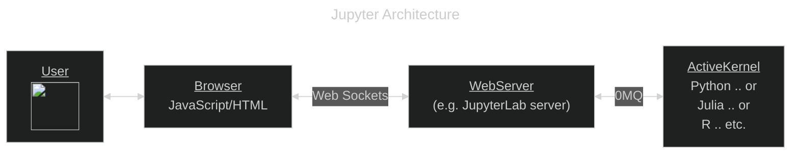
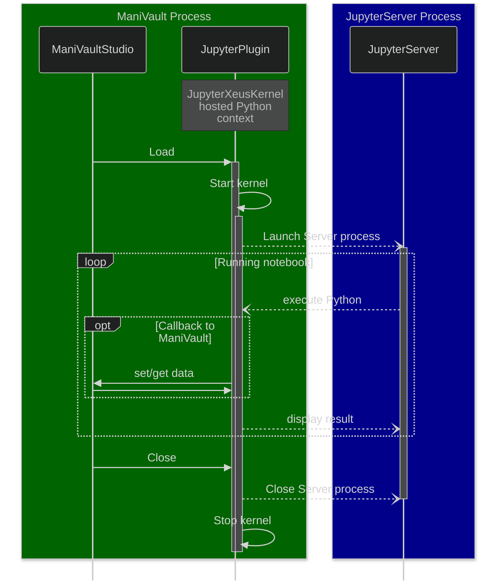
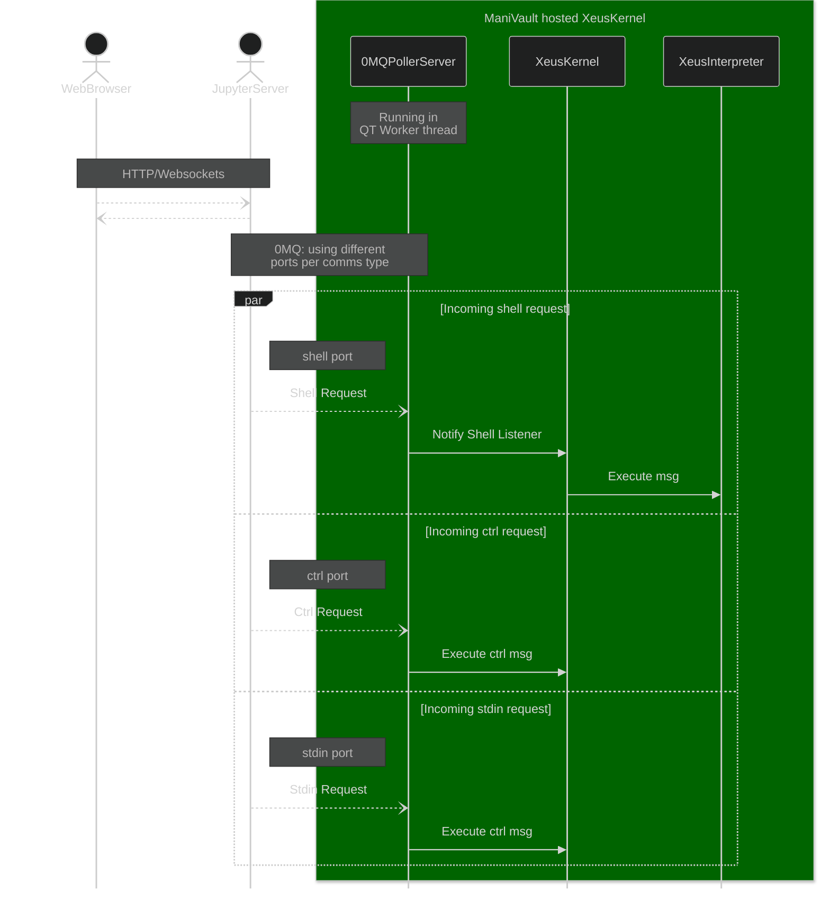

## JupyterPlugin -> JupyterLab Viewer Plugin

The plugin runs a **Jupyverse** Jupyter Lab server. The server offers a connection to the plugin's hosted python kernel.

The plugin supplies a module containing methods that can be accessed from a Jupyter notebook. See the Example notebook for more information.

Although the articture is a view plugin the actual view should be access via a web browser. The plugin it's shows no more than c aconfiguration widget. In addition the URL (along with token) to be used to access this kernel through

## Building

Using conan you can install the required xeus dependencies following from our lkeb artifactory 

Artifactory | URL
--- | ---
lkeb-artifactory | https://lkeb-artifactory.lumc.nl/artifactory/api/conan/conan-local

And define the following variables

Dependency (conan format) | Required CMAKE variable
--- | ---
xeus/3.1.4@lkeb/stable | xeus_ROOT
xeus-zmq/1.1.1@lkeb/stable | xeus-zmq_ROOT
xeus-python/0.15.12@lkeb/stable | xeus-python_ROOT


### Kernel architecture

The kernel relies on Jupyter-Xeus components to expose a python 3.11 environment. 

The architecture of hte kernel is based on Slicer/SlicerJupyter.  The correspondance is shown in the table below.

ManiVault JupyterPlugin | Slicer SlicerJupyter extension | Manivault Example
---| --- | ---
JupyterXeusKernel | qSlicerJupyterKernelModule | n.a.
JupyterPlugin | qSlicerJupyterKernelModuleWidget | ExampleViewPlugin

<br><br>

## Understanding Jupyter and the PythonJupyterPlugin

### Basic Jupyter architecture

This is a brief introduction to how JupyterLab/Notebook works, it assumes that your are familiar with running and using JupyterLab/Notebook from a python environment with a web browser.

Jupyter comprises a webserver that can ve viewed using a standard HTTP and JavaScript capable webbrowser. The webserver communicates with and a kernel running in a process separate over 0MQ ([ZeroMQ](https://zeromq.org/)) on a number of ports. 



An <ins>ActiveKernel</ins> is an execution context in which language commands are executed. Jupyter supports multiple kernels we are interested in a Python kernel that will be hosted in our plugin. 

### Startup & Shutdown

As is clear from the architecture starting the plugin depends on a <ins>WebServer</ins>. This must be started to provide the Jupyter web service that can connect to our Plugin hosted python kernel. The Browser could also be hosted in a Window (using QT WebEngine) but the initial version will simply provide a URL for the <ins>WebServer</ins>

### Choosing a <ins>WebServer<ins>
Possible servers are :

1. JupyterLab server - hosted in Python. This could be an external python or an python version supplied with the plugin: `pip install jupyterlab_server`

2. [Jupyverse server](https://davidbrochart.github.io/jupyverse/install/) - hosted in Python. `pip install "jupyverse [jupyterlab,auth]"

#### Startup/Shutdown sequence diagram




### PythonJupyterPlugin architecture

The main class in the *PythonJupyterPlugin* is the *JupyterXeusKernel* that is created on startup. Details of this class and its subcomponents are illustrated here for reference.
 
#### The XeusKernel

This diagram only shows the interaction of messages that execute Python code in the kernel without calling back to ManiVault. The XeusKernel is a C++ implementation of a Jupyter Kernel that is in the JupyterPlugin.

#### Interacting with XeusKernel: sequence diagram



The main points here are the 3 architectural subcomponents of the XeusKernel: 

1. 0MGPollerServer: Handles the logical level Jupyter protocol in a QT event loop compliant manner (events to an from WorkerThread)
2. XeusKernel: Handle the application level Jupyter protocol. In particular it dispatches execution related functions to the interpreter 
3. XeusInterpreter hosts the Python execution context (using the python.dll) 

### Making a development environment

To test this plugin a python environment is needed with both jupyter lab and the MVJupyterPluginManager (contained in this repo.) The python version should be 3.11

1. To emulate a shipped embedded python download the python [embeddable package for your OS](https://www.python.org/downloads/release/python-3117/).
2. Add pip to this environment [using get-pip.py](https://pip.pypa.io/en/stable/installation/)
3. pip install [jupyterlab](https://pypi.org/project/jupyterlab/)
4. Install the MVJupyterPluginManager package in this repo using 
```
pip install <path-to-this-repo>
```
5. Build ManiVault along with the JupyterPlugin and start the session.
6. Loading the Jupyter Plugin in ManiVault (it is a View plugin) starts the kernel.
7. Once the kernel is running start Jupyter Lab giving the kernel manager and provisioner classes (from MVJupyterPluginManager) to the Jupyter server/client software: 

```
python -m jupyterlab_server --ServerApp.kernel_manager_class=MVJupyterPluginManager.ExternalMappingKernelManager --KernelProvisionerFactory.default_provisioner_name=mvjupyterplugin-existing-provisioner
```
8. At this point Jupyter Lab will start and connect to the running ManiVault kernel. This will show in the output with output similar to this: 

```
INFO:root:Attaching to ManiVault kernel
DEBUG:asyncio:Using selector: SelectSelector
INFO:MVJupyterPluginManager.provisioning:ManiVault JupyterPython kernel = D:\TempProj\DevBundle\Jupyter\install\Debug\external_kernels\ManiVault\connection.json
INFO:MVJupyterPluginManager.provisioning:Loaded the ManiVault connection information
[I 2024-02-07 13:31:19.502 ServerApp] Kernel started: ea4b5ff9-49ca-4164-adf6-86460e73b265
[I 2024-02-07 13:31:19.504 ServerApp] Attaching ea4b5ff9-49ca-4164-adf6-86460e73b265 to an existing kernel...
INFO:MVJupyterPluginManager.manager:ManiVault Jupyter kernel = D:\TempProj\DevBundle\Jupyter\install\Debug\external_kernels\ManiVault\connection.json
[I 2024-02-07 13:31:19.530 ServerApp] Connecting to kernel ea4b5ff9-49ca-4164-adf6-86460e73b265.
[I 2024-02-07 13:31:19.553 ServerApp] Connecting to kernel ea4b5ff9-49ca-4164-adf6-86460e73b265.
```