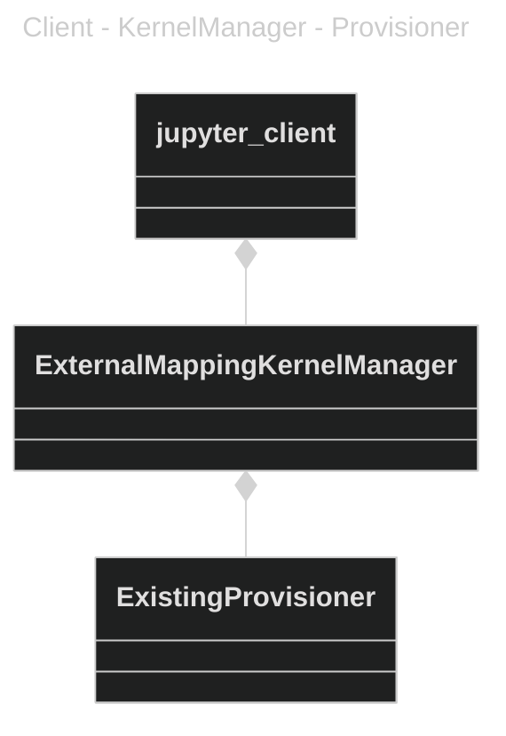

## MVJupyterPluginManager

A kernel manager that allows JupyterLab to connect to an externally started kernel. In out case this is the kernel that runs in the JupyterPlugin.

The code is largely copied from the examples in https://github.com/pyxll/pyxll-jupyter/tree/master/pyxll_jupyter/kernel_managers, https://github.com/SciQLop/SciQLop/tree/main/SciQLop/Jupyter and https://github.com/ebanner/pynt/tree/master/codebook

JupyterLab can be started with the [ServerApp.kernel_manager_class](https://jupyterlab-server.readthedocs.io/en/stable/api/app-config.html) and KernelProviderFactory options. Read the piece on the [kernel provisioner relationship in the client doc](https://jupyter-client.readthedocs.io/en/stable/provisioning.html) for more details of this system. 


### Starting the server with the MV KernelManager and Provisioner

The complexity of setting the KernelManager and Provisioner is handled by the `__main__` entry point in MVJupyterPluginManager. The only thing that needs to be provided is the path to the connection.json that is output by the JupyterPlugin. 
```
python -m MVJupyterPluginManager D:\TempProj\DevBundle\Jupyter\install\Debug\external_kernels\ManiVault\connection.json
```

### Kernel definition and installation

Enabling a kernel for the existing provisioner requires the installation of the following files : 

```
kernel.json
logo-32x32.png
logo-64x54.png
```

Assuming these are in a directory called `/temp/ManiVaultStudio`, they can be installed using 

```
jupyter kernelspec install /temp/ManiVaultStudio --user
```

This will make the kernel available via the user settings.

Check that the provisioner was installed using this command to list provisioners 

```
jupyter kernelspec provisioners
```

For more information see the [Jupyter Client Provisioning documentation](https://jupyter-client.readthedocs.io/en/stable/provisioning.html)

The provisioner name `mvjupyterplugin-existing-provisioner`is available as entry-point in the MVJupyterPluginManager package to map to MV's `ExistingProvisioner` class. Specifically this definition is in the `pyproject.toml` (which uses `poetry`) defined in the `[tool.poetry.plugins."jupyter_client.kernel_provisioners"]` entry.

### Contents of the ManiVaultStudio kernel.json

Unlike the standard python kernel this provisioner connects to a kernel hosted in ManiVaultStudio. The usual entries in the `kernel.json` contain a restart command but this comprises solely a name and metadata related to the provisioner.

```
{
	"display_name": "ManiVault (JupyterPlugin)",
	"language": "python",
	"metadata": {
	  "kernel_provisioner": {
		"provisioner_name": "mvjupyterplugin-existing-provisioner"
	  }
	}
}
```


Refer to the [jupyterlab-server doc](https://jupyterlab-server.readthedocs.io/en/latest/api/app-config.html) and the [jupyter-client doc](https://jupyter-client.readthedocs.io/en/stable/provisioning.html) for more details on the commandline options.

Baldur van Lew
2024-02-06

Note: In principle Jupyverse should be capable of connecting to an external kernel but this does not seem to work https://github.com/jupyter-server/jupyverse/issues/385