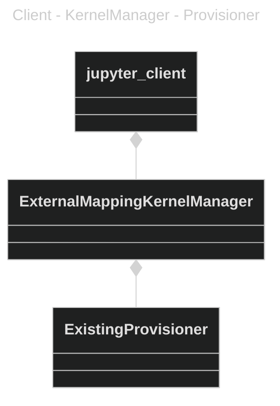

## MVJupyterPluginManager

A kernel manager that allows JupyterLab to connect to an externally started kernel. In out case this is the kernel that runs in the JupyterPlugin.

The code is largely copied from the examples in https://github.com/pyxll/pyxll-jupyter/tree/master/pyxll_jupyter/kernel_managers, https://github.com/SciQLop/SciQLop/tree/main/SciQLop/Jupyter and https://github.com/ebanner/pynt/tree/master/codebook

JupyterLab can be started with the [ServerApp.kernel_manager_class](https://jupyterlab-server.readthedocs.io/en/stable/api/app-config.html) and KernelProviderFactory options. Read the piece on the [kernel provisioner relationship in the client doc](https://jupyter-client.readthedocs.io/en/stable/provisioning.html) for more details of this system. 


### Starting the server with the MV KernelManager and Provisioner

The complexity of setting the KernelManage and PRovisioner is handled by the `__main__` entry point in MVJupyterPluginManager. The only thing that needs to be provided is the path to the connection.json that is output by the JupyterPlugin. 
```
python -m MVJupyterPluginManager D:\TempProj\DevBundle\Jupyter\install\Debug\external_kernels\ManiVault\connection.json
```


The provisione rname `mvjupyterplugin-existing-provisioner`is defined in the MVJupyterPluginManager package to map to MV's `ExistingProvisioner` class

Refer to the [jupyterlab-server doc](https://jupyterlab-server.readthedocs.io/en/latest/api/app-config.html) and the [jupyter-client doc](https://jupyter-client.readthedocs.io/en/stable/provisioning.html) for more details on the commandline options.

Baldur van Lew
2024-02-06

Note: In principle Jupyverse show be capable of connecting to an external kernel but this does not seem to work https://github.com/jupyter-server/jupyverse/issues/385