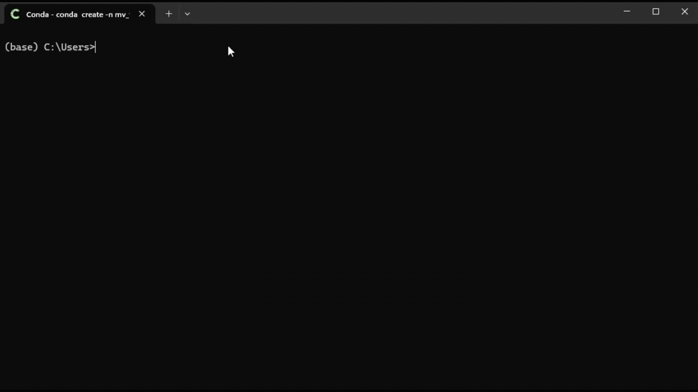
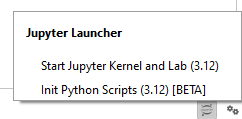
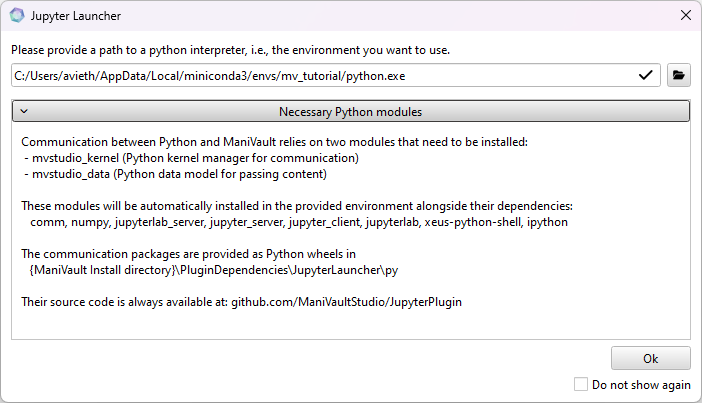
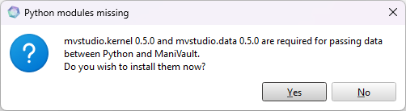
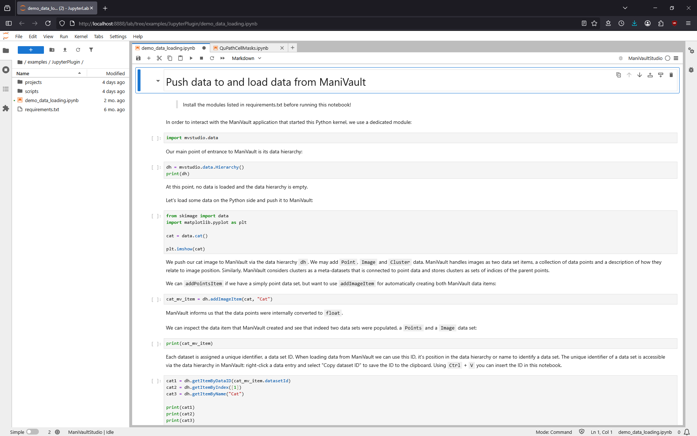
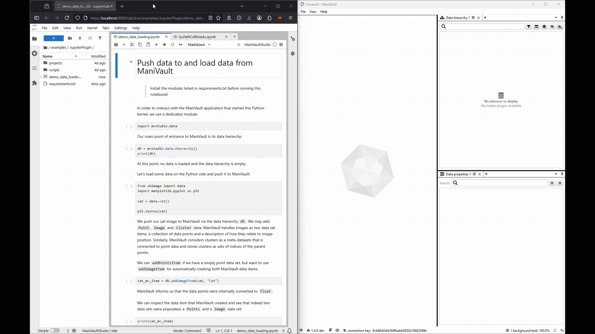

You can use any local python environment with the Jupyter Launcher to interact with ManiVault. 

### Set up an environment

Create a Python environment, e.g. here we use conda:

```python
conda create -n mv_tutorial -y python=3.12
```



The Python version must correspond with the installed Jupyter plugin(s).

### Start the launcher

In the lower right corner of the ManiVault window, next to the two cogs, find a small Jupyter notebooks:


We want to select `Start Jupyter Kernel and Lab`. 
If multiple versions are available, select the same version as your Python environment.
In our case, `mv_tutorial`, that's 3.12.



When starting the plugin, you are asked to provide a path the python interpreter (of your intended environment).
Click on the folder icon and navigate to your python interpreter.
In our case, the interpreter is located at `C:\Users\avieth\AppData\Local\miniconda3\envs\mv_tutorial\python.exe`.

If you intend to always use the same environment, you may toggle `Do not show again`. 
You can always change this via `File` -> `Settings` -> `Plugin: Jupyter Launcher` -> `Python interpreter`.



On every start, ManiVault checks if two modules that are required for the communication between Python and ManiVault are installed.
Of course, they only need to be installed on the first start-up with any given environment:



After a successful connection between ManiVault and Python, a Jupyter environment will automatically open in your default browser.



We now may run any script of our choice. 
For the `demo_data_loading.ipynb` we first need to make sure that all it's requirements are satisfied.
Open a console in `examples\JupyterPlugin` in your ManiVault install location and execute in your Python environment:
```python
pip install -r requirements.txt
```
We can now move data from Python to ManiVault and vice versa:


